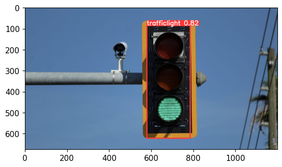
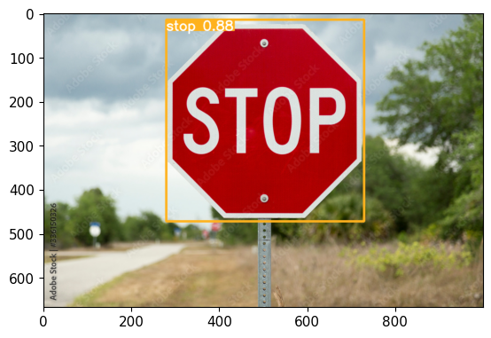

# Detecção de Placas de Trânsito com YOLOv5

Este é um projeto que utiliza o modelo de Deep Learning YOLOv5 para a detecção de placas de trânsito em imagens e vídeos. O YOLOv5 é um framework de detecção de objetos em tempo real, conhecido por sua alta velocidade e precisão.

## Descrição do Projeto

O objetivo deste projeto é identificar e localizar placas de trânsito em imagens e vídeos, auxiliando em tarefas de monitoramento e análise de segurança viária. Utilizando a arquitetura YOLOv5, o modelo foi treinado com um conjunto de dados contendo imagens de placas de trânsito de diferentes tipos, tamanhos e ângulos de visão.

O modelo de detecção é capaz de identificar diferentes tipos de placas de trânsito, como placas de limite de velocidade, placas de parada obrigatória, placas de proibição, entre outras. Ele pode ser facilmente adaptado para detecção de placas específicas de acordo com as necessidades do projeto.

## Treinamento do Modelo

O modelo YOLOv5 foi treinado utilizando o conjunto de dados disponivel no Kaggle. Foram executadas várias épocas de treinamento, ajustando os hiperparâmetros para obter um desempenho satisfatório na detecção de placas de trânsito. Os pesos do melhor modelo alcançado durante o treinamento estão disponíveis no repositório.

## Resultados e Discussão

O modelo treinado demonstrou uma boa capacidade de detecção de placas de trânsito em diferentes cenários. Ele foi capaz de identificar corretamente a maioria dos tipos placas que selecionamos, mesmo em condições desafiadoras, como baixa iluminação ou ângulos de visão variados. No entanto, em casos de placas danificadas ou parcialmente ocultas, o desempenho pode ser comprometido.

## Contribuição

Contribuições são bem-vindas para melhorar o desempenho do modelo, adicionar suporte a novos tipos de placas de trânsito ou propor novas funcionalidades relacionadas ao projeto. Sinta-se à vontade para enviar pull requests com suas contribuições.

## Licença

Este projeto está licenciado sob a

 [MIT License](LICENSE), permitindo o uso livre e a modificação do código fonte.

## Referências

- [YOLOv5](https://github.com/ultralytics/yolov5): Repositório oficial do YOLOv5.
- [Referência do YOLOv5](https://docs.ultralytics.com/yolov5/): Documentação oficial do YOLOv5.

## Banco de dados utilizado

- https://www.kaggle.com/datasets/andrewmvd/road-sign-detection
